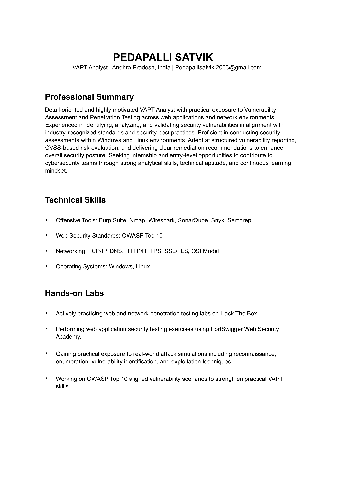
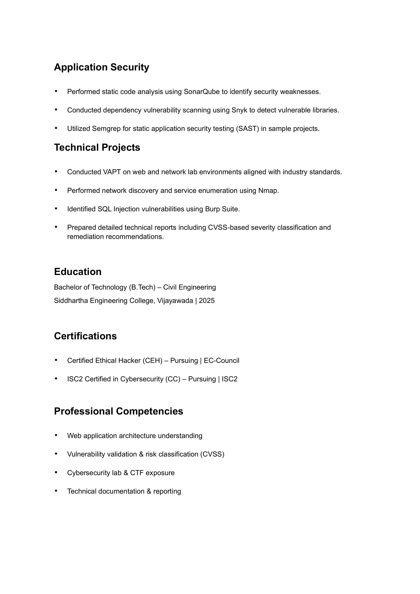
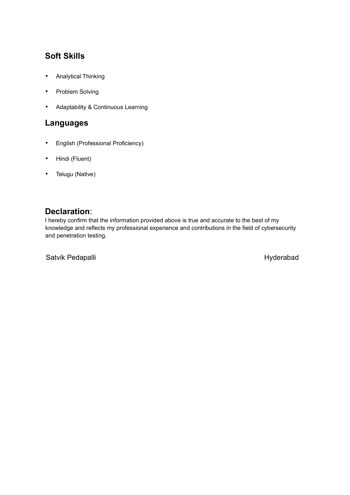

# Satvik Pedapalli 👋

### 🛡️ Aspiring Penetration Tester | Ethical Hacking & Security Research
Dedicated to identifying and mitigating vulnerabilities to secure digital infrastructure. Currently focusing on application security and network penetration testing.

---

### 🚀 Technical Skills & Tools

  
  
  
    
  
  
  
    
  

---

### 📄 Resume

  <a href="./resume.pdf"><b>📥 Click here to download the full 3-Page PDF</b></a>

---

### 📊 GitHub Activity
